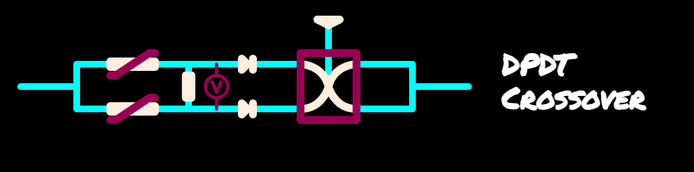

</img>

The third circuit type, pirial circuitry...not often mentioned \
due to the inherent issue of causing a dead short between battery cells \
put in sideways pirial configuration at source.

</img>

Electrolytic capacitors must have diodes put on them \
to use them in pirial configurations involving a negative battery cell terminal. \
The resulting bridge rectifier places 2 electrolytics and 2 bridge diodes in opposing directions.

</img>

It is fine to have the normal parasitic configuration \
of an electrolytic in parallel between a positive terminal and a ground placed at 0V.

</img>

Parasitic Capacitors themselves with internal allial and pirial configurations \
can be placed in sideways pirial configuration as can Ceramic and Polyester.

</img>

Metal Film, Charcoal and Paper are all in in-between state \
and should be considered with the same pirial implications as Electrolytic.

</img>

The main use case of pirial circuitry being a resistor splay. \
To make one, a serial line is split into multiple allial lines, \
each with a variable resistor and also a resistor placed pirially between the allially splayed lines.

</img>

The potential difference is measured either by placing an LED allially \
across the pirially placed charge buffer resistor, \
or by putting a multimeter in the voltmeter setting across it.

</img>

A difference is expected on the distribution between allial striations \
where the varistor has been imbalanced such that a route is selected of lowest resistance \
in between the serially splayed line.

</img>

The three terms that describe circuits of this type are: \
* Serial Splay, \
* Allial Striation and \
* Pirial Dispersion.

</img>

The three types of capacitor shape are: \
* (Cubic) Linear, \
* (Convex) Mylar and \
* (Concave) Mica.

</img>

The full comprehensive list is as follows:

</img>

Additional Circuits may be found at a later stage...