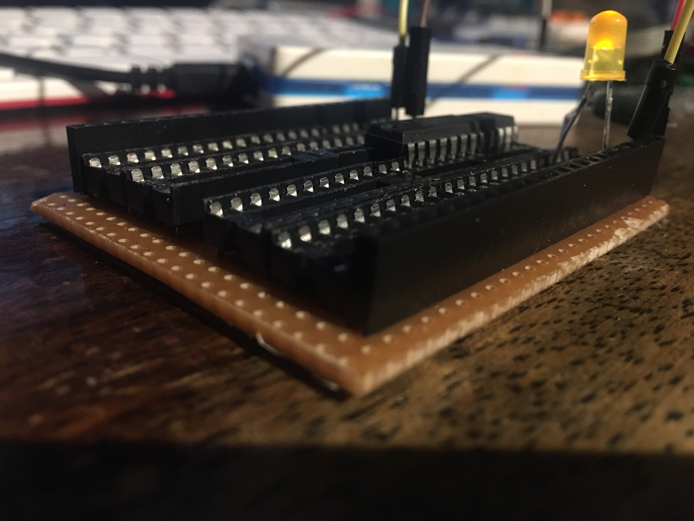

# Protoduino / Veroduino

~~Coming Soon...~~

The initial prototype is as follows: \
A piece of protoboard/veroboard with the functionality of a custom DIP-based microcontroller.

</img>

From the back of previous projects such as reduino, cyberpunk uno and motorola mega68k shield, \
Protoduino follows on from them by using the pieces as a stencil outline for deciding dimensions.

</img>

This is what the final layout looks something like. \
Some stacking headers might be required to get the top row of pins to align correctly.

</img>

Here is a componentry view of the parts required to build one of these. \
You will need: A piece of veroboard, some 24-pin 2.54mm pitch space pcb sockets and some DIP sockets.

</img>

It must be observed that the correct orientation of the veroboard is this. \
Any other orientation does not work as intended and will have to be re-cut in the milling process.

</img>

Great care must be observed when handling sharp tools and precision objects. \
Once each set of tracks has been isolated, it has to be tested for lack of continuity with a multimeter.

</img>

The components fit on one side of the board and a layer of solder joins pins to tracks. \
First solder the DIP sockets and then add the 24-pin sockets afterwards for equal flatness.

</img>

The underside of the board should not be in contact with a metal surface during operation \
as this could cause a short which may stop the board from functioning correctly.

</img>

The DIP chips of immense variety can be placed in the central bridge of the protoduino. \
To route the pins to the headers, either some DIP Switches or some extra peripherals will be required.

</img>

Here is one version of the veroduino which has been pre-programmed with an ATTiny45 running blink. \
It has a W21 Input Safety Resistor saddled on the back and flying leads selecting the routing.

</img>

When all said and done, the protoduino is an extremely versatile board for experimenting \
with all kinds of DIP Chips and electronic passives found in the replacement parts of other kits.
